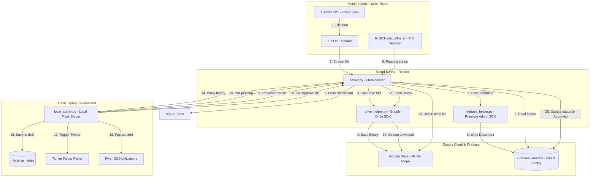

# 📁 Dad Bills — Complete Project Architecture & Reference Manual

This document provides a highly detailed guide to the **Dad Bills** application. It details the file structure, library usages, system architecture, user workflows, deployment strategies, and OAuth protocol mechanisms.

---

## 🗺️ System Architecture Diagram



---

## 📂 File-by-File Explanation & Package Utilities

Here is a breakdown of what every file in the directory is used for, along with explanations of the packages imported:

### 1. `server.py`
* **Purpose**: Serves as the primary public-facing Flask backend. It runs in the cloud (deployed on Render) and acts as the bridge between the client (who uploads bills) and the database/Google Drive storage.
* **Key Endpoints**:
  * `/`: Serves the user interface (`index.html`) in Client mode.
  * `/client`: Alias for the client interface.
  * `/admin`: Serves the admin panel interface.
  * `/oauth/connect` & `/oauth2callback`: Handles initiation and callbacks for Google OAuth.
  * `/upload`: Receives uploaded files, uploads them to Google Drive, registers their metadata in Firebase, and triggers push alerts.
  * `/pending`: Streams the list of pending bills directly from Firestore.
  * `/sync-drive`: Lists all files stored under the sync folder in Google Drive.
  * `/view/<file_id>`: Downloads a file binary from Google Drive and proxies it as a stream so the admin can review the PDF/image directly in their web browser.
  * `/decide/<file_id>/<action>`: Handles administrative actions (`approve` or `reject`). On `approve`, it updates Firestore status and deletes the temporary file from Google Drive. On `reject`, it moves the file to a `Rejected` folder in Drive and updates Firestore status.
  * `/status/<file_id>`: Allows the client to poll the status of a specific upload.
* **Why the imported packages are useful**:
  * `flask`: Lightweight framework used to handle HTTP routing, request parameters, file uploads, and session management.
  * `socket`: Used specifically for executing a UDP socket check to resolve the server's local IP address on startup.
  * `requests`: Triggers external API notifications to `ntfy.sh` (sending mobile push alerts).

### 2. `local_admin.py`
* **Purpose**: Runs locally on the administrator's laptop. Since cloud servers cannot write files directly to your laptop's physical hard drive (`F:\` or local directories) due to security sandboxing, this local script functions as a proxy helper. It fetches metadata/binaries from the cloud server and writes them directly to local disk.
* **Key Components**:
  * Listens on `localhost:5000`.
  * Communicates with the cloud server (defined in `cloud_url.txt`).
  * `/sync-accept`: Fetches the file's binary stream from the Cloud Server's `/view/<file_id>` endpoint, writes it to the local system (`F:\Bills` or a fallback), triggers native Windows desktop popups, and requests the Cloud Server to mark the bill as approved.
  * `/browse-folder`: Spawns a native OS folder picker using Python's GUI toolkit (`tkinter`) to allow the admin to dynamically select download paths.
* **Why the imported packages are useful**:
  * `tkinter` & `filedialog`: Renders native desktop interface folder-selection dialogs.
  * `plyer`: Interacts with native OS notification systems. It is used to generate desktop notification toasts in Windows when a file is successfully synced.

### 3. `drive_helper.py`
* **Purpose**: A utility class containing Google Drive API operations. It manages authentication flows, creates directory trees, uploads documents, generates streams, and deletes/moves files.
* **Key Functions**:
  * `get_drive_service()`: Resolves and initializes the Google Drive client. It retrieves the OAuth token from Firebase Firestore. If the access token is expired but a refresh token is present, it automatically requests a new token from Google and updates it in Firebase.
  * `get_flow()`: Creates the authentication flow object using the application's Client Secrets (`credentials.json` or `GOOGLE_CREDENTIALS`).
  * `upload_to_drive()`: Checks for a root folder named `DadBillsSync` and the appropriate category subfolder (e.g. `Jio Fiber`). If they don't exist, it creates them before uploading the raw file.
  * `move_file_to_rejected()`: Changes a file's parent directory in Google Drive to the `Rejected` subfolder when the admin rejects a bill.
* **Why the imported packages are useful**:
  * `google-api-python-client` (`googleapiclient.discovery`): Compiles client libraries to invoke the Google Drive v3 REST API.
  * `google-auth-oauthlib`: Simplifies the initial OAuth 2.0 authorization code exchange.
  * `google-auth` (`google.oauth2.credentials`): Manages token structures, verification, and automated refreshing.

### 4. `firebase_helper.py`
* **Purpose**: Manages connections and operations for the Firestore NoSQL database. Firestore acts as a shared database that both the cloud server and local proxy script can access.
* **Key Functions**:
  * `init_firebase()`: Authenticates the app using Firebase credentials (either from the environment variable `FIREBASE_CREDENTIALS` or a local `firebase-credentials.json` file).
  * `save_drive_token()` / `get_drive_token()`: Stores and retrieves the Google Drive OAuth JSON token inside the Firestore `config` collection. This allows stateless web services (like Render) to preserve authentication across restarts.
  * `add_pending_file()`: Registers an uploaded bill's metadata (e.g., file ID, display name, category, status="pending") in the `bills` collection.
  * `list_pending_files()`: Queries and returns all documents where `status == "pending"`.
* **Why the imported packages are useful**:
  * `firebase-admin`: The official SDK to read and write data in Google Firebase services securely.

### 5. `templates/index.html`
* **Purpose**: The front-end user interface. It is shared between the client and admin views.
* **Key Mechanisms**:
  * Styled with CSS and Tailwind CSS framework logic.
  * Renders upload forms for the Client and lists pending items for the Admin based on the `IS_ADMIN` backend flag.
  * Embeds an in-browser PDF/image review viewport.
  * Contains polling scripts:
    * **Client-side**: Polls `/status/<file_id>` every 2 seconds after upload to show real-time approval status.
    * **Admin-side**: Polls `/pending` every 5 seconds (if "Auto Check" is toggled on) to keep the list updated.

### 6. `run_background.vbs` & `stop_background.bat`
* **Purpose**: Windows utility scripts. `run_background.vbs` utilizes a Visual Basic script to spin up `local_admin.py` in the background (preventing a command prompt window from staying open). `stop_background.bat` runs a command to find and terminate the running background process.

---

## 🔄 User Workflows: Client vs. Admin

### Client Flow (Dad's Mobile Phone)
```
[Dad's Mobile] ---> Fill Form (e.g. Jio Bill, PDF) ---> Click Submit
                                                              │
                                                              ▼
                                                   [Cloud Flask Server]
                                                              │
                                     ┌────────────────────────┴────────────────────────┐
                                     ▼                                                 ▼
                          Upload file to Google Drive                      Insert metadata to Firestore
                         (DadBillsSync/Jio Fiber/...)                      (ID: doc_123, status: "pending")
                                                                                       │
                                                                                       ▼
                                                                           Send Push Alert (ntfy.sh)
                                                                                       │
                                                                                       ▼
                                                                            [Poll Loop Starts]
                                                                        Queries /status/doc_123
                                                                        Every 2 seconds
```

### Admin Flow (Your Laptop Dashboard)
```
                                                                             [Local Admin App]
                                                                          (Polls /pending cloud api)
                                                                                       │
                                                                                       ▼
                                                                            Displays doc_123 under
                                                                             "Pending Approval"
                                                                                       │
                                                                                       ▼
                                                                             Admin Clicks Approve
                                                                                       │
                                                                                       ▼
                                                                             [Local Admin App]
                                                                       1. Downloads binary from cloud
                                                                       2. Saves to F:\Bills\Jio Fiber\
                                                                       3. Desktop notification pops up
                                                                       4. Calls Cloud /decide/approve API
                                                                                       │
                                                                                       ▼
                                                                             [Cloud Flask Server]
                                                                     1. Deletes file from Google Drive
                                                                     2. Updates Firestore status: "approved"
                                                                                       │
                                                                                       ▼
                                                                          [Client Phone Poll Loop]
                                                                        Receives "approved" status,
                                                                        stops spinner, shows green success!
```

---

## ☁️ How Render Deployment Works

Render is a modern cloud hosting platform. To host this project on Render, it is configured as a **Web Service**:

1. **Stateless Filesystem**:
   Render containers are stateless and ephemeral. Any local file saved on a Render instance is deleted whenever the service redeploys, restarts, or goes to sleep.
   * **Why this matters**: We cannot save Google Drive OAuth credentials as a local `token.json` file on Render. They would be erased.
   * **Solution**: The application saves the OAuth token into **Firebase Firestore** (which is persistent cloud database storage) and fetches it on startup.
2. **Environment Variables & Secret Files**:
   * To authenticate with Google, we need `credentials.json`. Render allows uploading this as a **Secret File** inside the service workspace.
   * To authenticate with Firebase, we need `firebase-credentials.json`. The entire contents of this JSON file are pasted into an environment variable called `FIREBASE_CREDENTIALS` in the Render dashboard. `firebase_helper.py` reads this environment variable, parses the string back into a JSON object, and initializes the SDK.
3. **Redirect URIs**:
   * Google OAuth requires register-matching redirect URIs. On Render, the application callback endpoint is updated to `https://your-service-name.onrender.com/oauth2callback`.

---

## 🔥 Firebase Firestore: Architecture & Schema

Firebase Firestore acts as a shared database. It is a NoSQL, document-oriented database. The project uses two Firestore collections:

### 1. `config` Collection
* **Document**: `google_drive_token`
* **Purpose**: Holds the Google Drive OAuth credentials token.
* **Fields**:
  * `token_data`: A JSON string representing the token details (access token, refresh token, expiry, scopes, token URI, and client metadata).

### 2. `bills` Collection
* **Document ID**: The Google Drive unique file ID (e.g., `1zXyWvUt...`).
* **Purpose**: Tracks the synchronization lifecycle of each document.
* **Fields**:
  ```json
  {
    "id": "1zXyWvUt-abcdefgh-ijklmnop",
    "name": "Electricity Bill May 2026",
    "filename": "Electricity Bill May 2026.pdf",
    "category": "current",
    "custom_folder": "",
    "status": "pending",
    "timestamp": "2026-06-15T11:42:15.000Z"
  }
  ```
  * `status` transitions: `"pending"` ➔ `"approved"` OR `"rejected"`.

---

## 🧩 Why So Many Tools & Libraries?

At first glance, it might look like a lot of packages for a simple bill collector. Here is the engineering design rationale:

* **Why a Hybrid System (Cloud + Local)?**
  Browsers cannot save files to a laptop disk automatically due to browser sandboxing. Also, your laptop IP is private and hidden behind a home router, making direct connection from mobile phones on cell networks impossible. The Cloud Server on Render is publicly accessible 24/7, while the Local Proxy runs locally to handle file writes and local folder configurations.
* **Why Google Drive?**
  Instead of renting expensive cloud database storage (like AWS S3) to host large PDF files, the app uses Google Drive. It is free, secure, and lets you organize folders (`Current Bill`, `Water Bill Receipt`) visually directly inside Google's web client.
* **Why Firebase Firestore?**
  Since the Render cloud service is stateless, it needs a external, persistent database to synchronize token states and metadata records. Firestore requires no database schema updates and has a free tier.
* **Why `ntfy.sh`?**
  Normally, sending mobile push notifications requires creating Apple Developer accounts ($99/yr), setting up Google Firebase Cloud Messaging (FCM), and coding native mobile apps. `ntfy.sh` is a free, subscription-based public notification gateway. By subscribing to a unique topic, the phone receives instant push alerts with simple HTTP requests.
* **Why Tkinter & Plyer?**
  Web pages cannot open native local folder picking dialogs or fire OS-level taskbar notifications. Spawning these from Python locally bridges the web UI to the desktop environment.

---

## 🔑 Google OAuth 2.0 & Drive Integration

### 1. The OAuth 2.0 Workflow
Google OAuth allows users to securely grant third-party applications limited access to their Google Account resources (in this case, Google Drive) without sharing their password.

```
[App (server.py)] ──(1) Redirect to Consent URL──> [Google Login / Permissions Screen]
                                                                   │
[App (server.py)] <──(2) Return Auth Code (callback) ──────────────┘
       │
       ├─(3) Exchange Auth Code + Client Secret for Access & Refresh Tokens
       ▼
[Save Tokens to Firebase] ──(4) build('drive', 'v3') ──> [Google Drive API]
```

1. **Initiation**: The Admin clicks "Connect Drive". The Flask server calls `drive_helper.generate_auth_url()`.
2. **Access Scopes**: The application requests the `https://www.googleapis.com/auth/drive.file` scope. This is a highly restrictive scope. The app can **only** read, write, edit, and delete files that *this specific application created*. It cannot view the rest of your private Google Drive files.
3. **Redirection**: The user is sent to Google's sign-in page, reviews the request, and grants permission.
4. **Callback**: Google redirects the browser to `/oauth2callback` with a unique temporary **Authorization Code** parameter.
5. **Token Exchange**: The backend intercepts this code and submits a POST request to Google's token endpoint, combining the code with the **Client ID** and **Client Secret** (from `credentials.json`).
6. **Token Issuance**: Google verifies the secret and returns two tokens:
   * **Access Token**: Short-lived (valid for 1 hour). Used to authenticate every API request to Google Drive.
   * **Refresh Token**: Long-lived. Used to request a new Access Token automatically when the old one expires.
7. **Persistence**: These tokens are stored securely in Firebase Firestore.

### 2. How Client ID and Client Secret Control Access
The **Client ID** acts as the application's username, and the **Client Secret** acts as its password. Together, they represent the application credentials.
* **Identification**: When Google receives a request to authenticate a user, the Client ID tells Google which app is asking.
* **Verification**: When exchanging the Authorization Code for an Access Token, the Client Secret proves that the backend requesting the token is indeed the authorized server (and not an attacker sniffing the redirect).
* **Token Refreshing**: When the short-lived access token expires, `drive_helper.py` calls:
  ```python
  creds.refresh(Request())
  ```
  Behind the scenes, the Google Auth library sends the stored **Refresh Token**, **Client ID**, and **Client Secret** back to Google. Google verifies the secret matches the client configuration, verifies the refresh token, and sends back a new, valid Access Token. This ensures the app runs continuously without prompting you to log in again.
